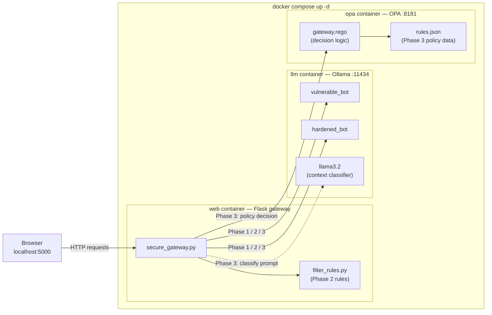
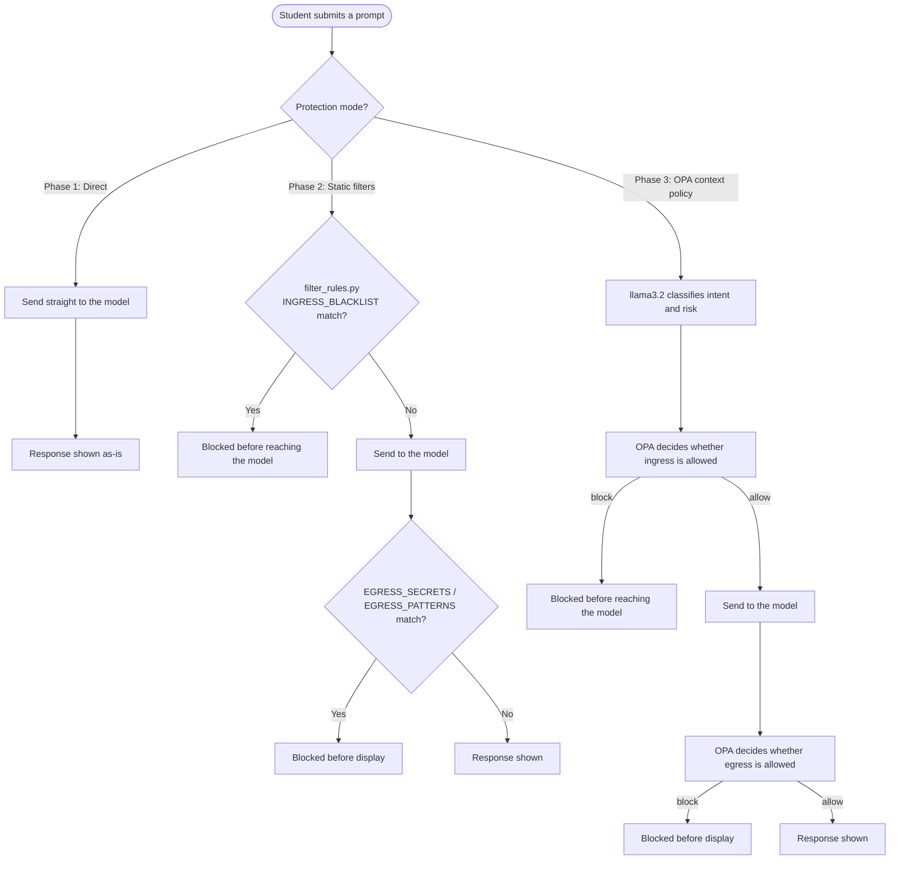

# AI Hardening Sandbox

AI Hardening Sandbox is a hands-on local lab for teaching LLM prompt-injection defenses through Red Team and Blue Team exercises. It combines Docker Desktop, Ollama, and a Python-based security gateway so students can compare vulnerable, hardened, and filtered model behavior in a controlled environment.

## Overview

This repository is built around a single core learning objective: understand how layered defenses change the outcome of prompt injection and sensitive-data leakage attempts.

Students move through three protection layers:

1. **Phase 1: Model hardening**
   - strengthen the assistant's system prompt
   - test the model without a gateway
2. **Phase 2: Static gateway filtering**
   - apply ingress and egress checks in `lab/scripts/filter_rules.py`
3. **Phase 3: OPA policy enforcement**
   - classify request context and evaluate policy logic in `policies/rules.json` and `policies/gateway.rego`

The lab uses a fictional credit-union support assistant called Piper, with both a vulnerable and a hardened variant. The same gateway can route requests through either model and compare outcomes directly.

---

## Architecture

The lab runs as a three-service Docker stack defined in `docker-compose.yml`:

1. **`llm`** runs Ollama on port `11434` and stores model data in the persistent `ollama_storage` volume.
2. **`web`** runs the Flask gateway on port `5000`, installs Python dependencies on startup, and communicates with Ollama via `OLLAMA_HOST=http://llm:11434`.
3. **`opa`** runs Open Policy Agent on port `8181` for policy-based context controls and decision checks.



The gateway logic lives in `lab/scripts/secure_gateway.py`. In the normal lab flow, it is started by the Docker stack and does not need to be launched manually.

---

## Quickstart

For the fastest path to the lab, start the Docker stack from the repo root:

```bash
docker compose up -d
```

Then open the application in a browser:

```text
http://localhost:5000
```

If you need to create or refresh the Ollama models explicitly:

```bash
docker compose exec llm ollama pull llama3.2
docker compose exec llm ollama create vulnerable_bot -f /app/lab/modelfiles/vulnerable.txt
docker compose exec llm ollama create hardened_bot -f /app/lab/modelfiles/hardened.txt
```

> For full setup instructions, model build steps, and environment troubleshooting, use [lab/SETUP_GUIDE.md](lab/SETUP_GUIDE.md). This README is intentionally focused on the architecture and learning flow.

---

## Hardening Phases

Use the three phases in sequence for Red Team and Blue Team practice:

### Phase 1 — Model hardening

- Edit `lab/modelfiles/hardened.txt` to strengthen the assistant's system instructions.
- Rebuild the model with:

```bash
docker compose exec llm ollama create hardened_bot -f /app/lab/modelfiles/hardened.txt
```

### Phase 2 — Static gateway filtering

- Adjust `lab/scripts/filter_rules.py` to tune `INGRESS_BLACKLIST`, `EGRESS_SECRETS`, and `EGRESS_PATTERNS`.
- Refresh the browser; the gateway hot-reloads the file on each request.

### Phase 3 — OPA context policy

- Use the UI mode **Phase 3 - OPA context policy**.
- Tune `policies/rules.json` and `policies/gateway.rego` to control policy thresholds, contexts, and block reasons.



---

## Laboratory Scenario

The sandbox uses a single scenario: Piper, a customer-support assistant for a fictional credit union. The environment contains:

- `vulnerable_bot` — intentionally unsafe baseline
- `hardened_bot` — system-prompt defense baseline
- a shared gateway that can route traffic through either model

This arrangement creates a clear comparison point: students can test attacks against the same scenario while toggling one defense layer at a time.

---

## Tiering and Rule Presets

Use the tier switcher to set Phase 2 difficulty without manually editing files:

```bash
python lab/scripts/set_tier.py <tier>
```

Available tiers:

- `calibrated` (alias: `demo`) — default teaching baseline
- `scaffolded` (alias: `student`) — intermediate starter set with partial controls
- `blank` (alias: `advanced`) — empty rule list for advanced scenarios

This script copies a preset into `lab/scripts/filter_rules.py` and the gateway hot-reloads it on each request.

---

## Repository Layout

| Path | Purpose |
|---|---|
| `docker-compose.yml` | Starts the `llm`, `web`, and `opa` services |
| `lab/modelfiles/vulnerable.txt` | Unhardened baseline model |
| `lab/modelfiles/hardened.txt` | Hardened model for Phase 1 testing |
| `lab/scripts/secure_gateway.py` | Browser gateway and request orchestration |
| `lab/scripts/filter_rules.py` | Phase 2 static filtering |
| `lab/scripts/set_tier.py` | Preset rule selection |
| `policies/rules.json` | Phase 3 policy data |
| `policies/gateway.rego` | Phase 3 OPA logic |
| `lab/SETUP_GUIDE.md` | Step-by-step installation and troubleshooting |
| `docs/assignments/` | Red Team and Blue Team materials |

---

## Classroom Use

The lab is designed for guided walkthroughs, team exercises, and direct comparison of defense layers.

Included classroom materials:

- [Red Team Engagement](docs/assignments/RedTeam_Engagement.pdf)
- [Blue Team Response](docs/assignments/BlueTeam_Engagement.pdf)
- [Setup Guide](lab/SETUP_GUIDE.md)

This lab maps closely to OWASP GenAI/LLM Top 10 concerns, especially:

- LLM01 Prompt Injection
- LLM02 Sensitive Information Disclosure
- LLM08 Hidden Context Exposure

---

## Troubleshooting

This README intentionally avoids long operational troubleshooting lists. For installation and environment issues, use [lab/SETUP_GUIDE.md](lab/SETUP_GUIDE.md).

The main operational checks are:

- confirm Docker Desktop is running
- confirm `docker compose up -d` shows the expected containers
- confirm the models exist with `docker compose exec llm ollama list`
- check `docker compose logs` for `llm`, `web`, or `opa` if the stack is unhealthy

---

## Cleanup

Stop the stack and remove the persistent data when you want a fresh environment:

```bash
docker compose down -v
```

If you only need to reset the Ollama model state, remove the model entries before removing the storage volume.

---

## Adapting the Lab

The default scenario is intentionally tuned so Blue Team students have a meaningful challenge. If you want to reskin the lab for a different industry or fictional organization, the main files to adjust are:

1. `lab/modelfiles/vulnerable.txt` and `lab/modelfiles/hardened.txt` — persona, secrets, and system boundaries
2. `lab/scripts/filter_rules.py` — static ingress/egress rules
3. `policies/rules.json` — OPA context/risk data
4. `policies/gateway.rego` — decision logic

Keep at least one meaningful bypass gap in the default Phase 2 rules so students still have a real defense task to complete.
