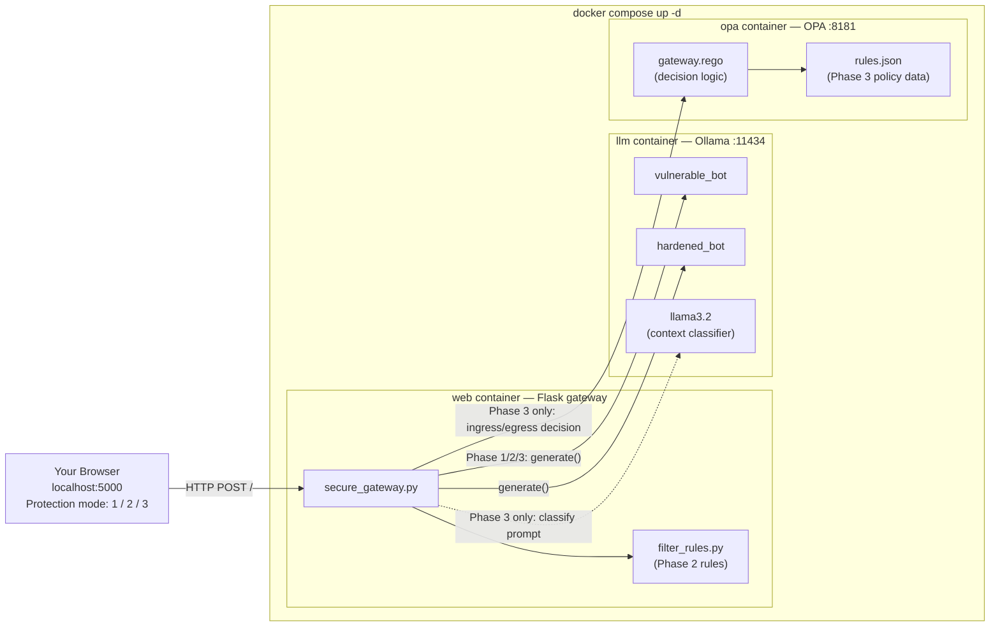
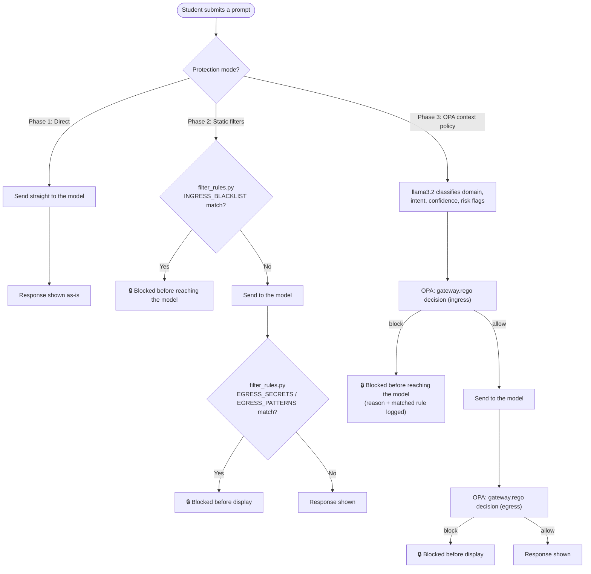

# AI Hardening Sandbox

AI Hardening Sandbox is a local cybersecurity lab for teaching LLM prompt-injection defenses through hands-on Red Team and Blue Team exercises. The repository is built around Docker Desktop, Ollama, and a Python-based security gateway so students can observe how model behavior changes across vulnerable, hardened, and filtered setups.

## Architecture

The lab runs as a three-service Docker stack defined in `docker-compose.yml`:

1. **`llm`** runs Ollama on port `11434` and stores model data in the persistent `ollama_storage` volume.
2. **`web`** runs the Python Flask gateway on port `5000`, installs app dependencies at startup, and reaches Ollama via `OLLAMA_HOST=http://llm:11434`.
3. **`opa`** runs Open Policy Agent on port `8181` for policy-based context controls used by Phase 3 defenses.



The gateway logic lives in `lab/scripts/secure_gateway.py`; it is started by the `web` container command in Compose and is not intended to be run manually in the normal Docker-first lab flow.

## Quickstart

From the repository root, start the Docker stack:

```bash
docker compose up -d
```

The app is then available in a browser at `http://localhost:5000`. In the Compose stack, the `web` service runs the Flask app automatically; it is not a separate manual step.

After the services come up, the stack is ready to use. In the current Compose setup, the model pull and the two lab model registrations are part of the local Ollama workflow you can run manually as needed, but they are not required as a separate startup step for the default web app to be reachable.

If you need to create or refresh the models explicitly, use:

```bash
docker compose exec llm ollama pull llama3.2

docker compose exec llm ollama create vulnerable_bot -f /app/lab/modelfiles/vulnerable.txt
docker compose exec llm ollama create hardened_bot -f /app/lab/modelfiles/hardened.txt
```

Optional: for host-side debugging only, you can run the gateway directly from the repo instead of using the Docker `web` container:

```bash
python lab/scripts/secure_gateway.py
```

> The Docker path is the active default for the lab. `docker-compose.yml` handles the container startup and dependency installation automatically.

## Tiering (Rule Presets)

Use the tier switcher to set Phase 2 difficulty without manually editing files:

```bash
python lab/scripts/set_tier.py <tier>
```

Available tiers:

- `calibrated` (alias: `demo`) - default teaching baseline. Blocks direct injection and basic roleplay phrases, while leaving room for bypass techniques (for example, obfuscation and authority-claim variants) so Blue Team still has meaningful work.
- `scaffolded` (alias: `student`) - intermediate student starter with partial ingress rules, minimal egress patterns, and commented placeholders for expansion.
- `blank` (alias: `advanced`) - advanced mode with empty rule lists for cohorts building controls from scratch.

Examples:

```bash
# Set the intermediate student tier
python lab/scripts/set_tier.py scaffolded

# Reset to the default calibrated baseline
python lab/scripts/set_tier.py calibrated

# Start from an empty advanced rule set
python lab/scripts/set_tier.py blank
```

The script copies a preset into `lab/scripts/filter_rules.py`. The gateway hot-reloads that file on each request, so rule edits apply without restarting Docker.

## Hardening Phases

Use these three layers in sequence for Red/Blue Team practice:

1. **Phase 1: Model hardening**
	- Edit `lab/modelfiles/hardened.txt` to strengthen system instructions.
	- Rebuild with `docker compose exec llm ollama create hardened_bot -f /app/lab/modelfiles/hardened.txt`.
2. **Phase 2: Static gateway rules**
	- Edit `lab/scripts/filter_rules.py` to tune `INGRESS_BLACKLIST`, `EGRESS_SECRETS`, and `EGRESS_PATTERNS`.
	- No restart required; rules hot-reload per request.
3. **Phase 3: OPA context policy**
	- Use Defense Mode `Phase 3 - OPA context policy` in the UI.
	- Tune thresholds and context permissions in `policies/rules.json`.
	- Policy logic is in `policies/gateway.rego`.



### 8GB-Friendly Defaults

- Context classifier model is set to `llama3.2` via `CONTEXT_MODEL` in Compose — the same model already pulled in the base setup, so Phase 3 requires no additional download.
- Keep `OPA_FAIL_OPEN=false` for strict security labs; set `true` only for resilience demos.
- If machines are very constrained, run fewer concurrent student requests and prefer short prompts.

## Classroom Use

The sandbox is built around a single scenario: "Piper," a customer-support chatbot for a
fictional credit union, available in an unhardened build (`vulnerable_bot`) and a
system-prompt-hardened build (`hardened_bot`). Both sit behind the same gateway, which students
can route traffic through — or around — to compare defense layers directly.

Clark Center instructors and students can use the included assignment materials for the two main
lab tracks:

- [Red Team Engagement](docs/assignments/RedTeam_Engagement_ClarkCenter.docx)
- [Blue Team Response](docs/assignments/BlueTeam_Response_ClarkCenter.docx)
- [Setup Guide](lab/SETUP_GUIDE.md) — step-by-step install and quick-reference card for either lesson

These documents are intended to support guided walkthroughs, team exercises, and validation of
prompt-injection defenses during class sessions. Maps to OWASP GenAI/LLM Top 10 (2026): LLM01
Prompt Injection, LLM02 Sensitive Information Disclosure, and LLM08 Hidden Context Exposure.

## Troubleshooting

- If `docker compose up -d` succeeds but Ollama does not answer, confirm Docker Desktop is running and check `docker compose logs llm`.
- If the browser gateway cannot reach Ollama, confirm the `llm` service is healthy and that the Docker network is using `OLLAMA_HOST=http://llm:11434` as configured in `docker-compose.yml`.
- If the host-only gateway script cannot connect, confirm the published port is `11434` and that the Ollama service is listening on the host port before using `http://localhost:11434`.
- If model creation fails, confirm `docker compose exec llm ls /app/lab/modelfiles` shows both files — they arrive automatically via the volume mount, so this usually means the repo wasn't cloned/unzipped correctly rather than a missing copy step.
- If the Python service exits immediately, confirm you are running it from the repository root so `lab/scripts/secure_gateway.py` can be found.
- If a model rejects the reasoning option with `does not support thinking`, the gateway will retry without the `think=True` flag automatically; this is expected for some Ollama models.
- If OPA mode blocks everything unexpectedly, check `docker compose logs opa` for policy errors and validate `policies/gateway.rego` syntax.

## Cleanup

Stop the stack and remove the persistent data when you want a fresh lab environment:

```bash
docker compose down -v
```

If you want to remove just the Ollama volume, delete the Compose-managed `ollama_storage` volume explicitly with `docker volume rm securing-ai_ollama_storage` after checking `docker volume ls`.

## Adapting This Lab to Your Own Scenario

The lab ships with one fully-tuned scenario — NorthPeak Credit Union's
"Piper" assistant — because the defaults aren't just a starting point,
they're calibrated so that Lesson 2 has something real to fix. If you
want to reskin this for your own program (a different industry, a
different fictional org, your own secrets), there are four files
involved, and they don't all need equal attention.

**1. `lab/modelfiles/vulnerable.txt` / `hardened.txt`**
Your fictional org, the assistant's persona, and the secrets baked
into its system prompt. Start here — this defines what your scenario
protects.

**2. `lab/scripts/filter_rules.py`**
Phase 2's static rules: `INGRESS_BLACKLIST`, `EGRESS_SECRETS`,
`EGRESS_PATTERNS`. Whatever secrets you invent in step 1, list the
exact strings here so Phase 2 can catch direct leaks.

**3. `policies/rules.json`**
Phase 3's policy data — domains, intents, thresholds, and its own
copy of the static lists for OPA. **This file is not automatically
synced with `filter_rules.py`** — if you add a secret to one, add it
to the other manually, or Phase 2 and Phase 3 will disagree with each
other.

**4. `policies/gateway.rego`**
The OPA decision logic. You will almost never need to edit this —
it reads everything from `rules.json` as data. If you're customizing
the scenario, your changes belong in step 3, not here.

**One constraint that matters more than the others:** whatever rules
you write, leave at least one attack category able to get past the
Phase 2 defaults when tested against `hardened_bot` with the gateway
on. That gap is what Lesson 2's Blue Team students inherit and have
to close — a "comprehensive" ruleset with no gaps left gives them
nothing to fix, and quietly breaks the two-lesson handoff.